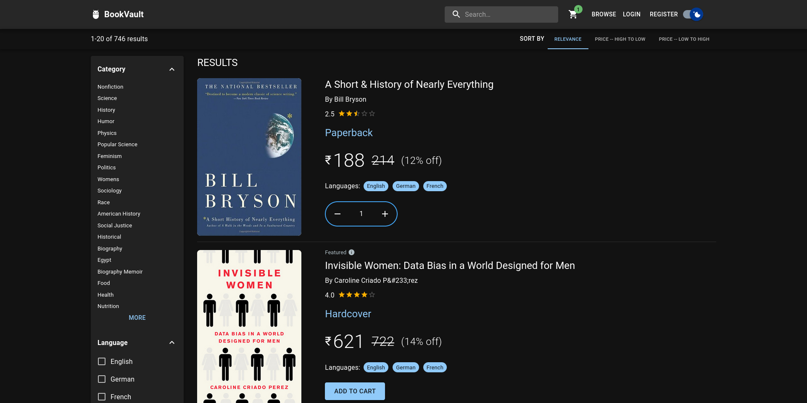

# BookVault
An ecommerce store to sell books

## How to run

Make sure you have `docker-compose` installed. Check [this](https://docs.docker.com/compose/install/) to install docker-compose.

```shell
$ docker-compose up --detach # to start the servers
$ docker-compose down        # to stop the servers
```

**Note:** By default the backend server will start at [localhost:8080](http://localhost:8080) and the frontend server will run at [localhost:8000](http://localhost:8000)

## Screenshot



## Sample data

The books are collected from [goodreads.com](goodreads.com). For more information check out [DataHarvestors](https://github.com/srijanmukherjee/DataHarvestors)